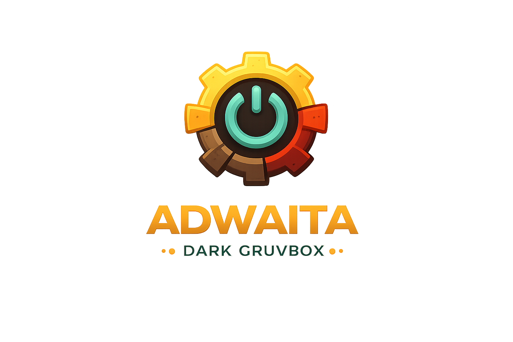
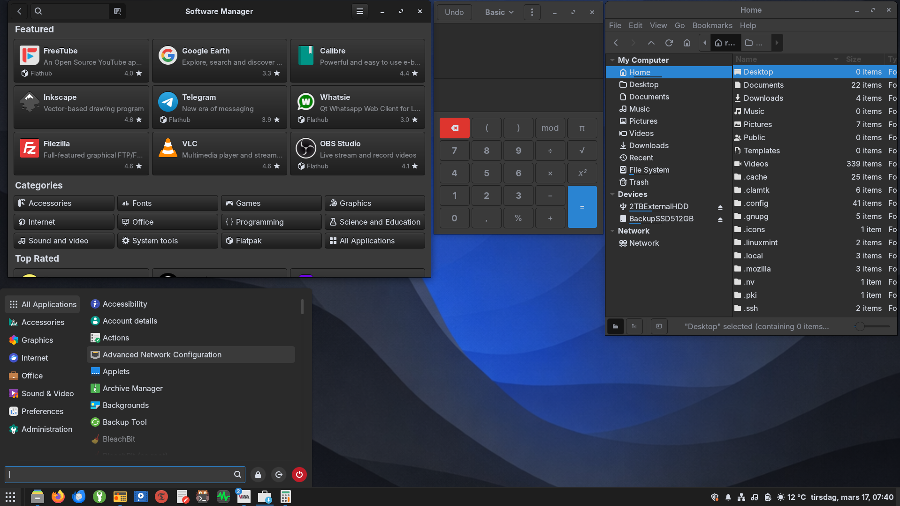

<p align="center">
  
</p>

<h1 align="center">Adwaita Dark Gruvbox</h1>

<p align="center">
A complete Gruvbox recolor of the classic Adwaita Dark GTK theme.
</p>

<p align="center">


</p>

---

## Preview



---

## Color Palette

| Element | Color |
|--------|------|
| Primary Accent | `#458588` |
| Background | `#282828` |
| Dark Surface | `#3c3836` |
| Borders | `#504945` |
| Primary Text | `#ebdbb2` |
| Secondary Text | `#bdae93` |
| Highlight Yellow | `#d79921` |
| Success Green | `#98971a` |
| Error Red | `#fb4934` |
| Warning Orange | `#d65d0e` |
| Purple Accent | `#b16286` |

---

## Coverage

| Layer | Status |
|------|-------|
| GTK2 | ✓ Legacy app support |
| GTK3 | ✓ Full, all widget states |
| GTK4 / libadwaita | ✓ See setup below |
| Cinnamon 6.x shell | ✓ Panel, menus, OSD, dialogs, notifications |

---

# Installation

Clone the repository:

```bash
mkdir -p ~/.themes

git clone https://github.com/librerob/Adwaita-Dark-Gruvbox \
~/.themes/Adwaita-Dark-Gruvbox

# or

git clone https://codeberg.org/librerob/Adwaita-Dark-Gruvbox \
~/.themes/Adwaita-Dark-Gruvbox
```

Or download the archive and extract it to:

```
~/.themes
```

Open **System Settings → Themes** and set:

```
Applictions
Desktop
```

to:

```
Adwaita-Dark-Gruvbox
```

OR

Activate Theme (Terminal)

Set the theme using gsettings:

```bash
gsettings set org.cinnamon.desktop.interface gtk-theme 'Adwaita-Dark-Gruvbox'
gsettings set org.cinnamon.desktop.wm.preferences theme 'Adwaita-Dark-Gruvbox'
gsettings set org.cinnamon.theme name 'Adwaita-Dark-Gruvbox'
```

To reload the Cinnamon shell without logging out:

```
Alt + F2
r
Enter
```

---

# Libadwaita Setup

Libadwaita applications do **not read themes from `~/.themes`**.

They instead read configuration from:

```
~/.config/gtk-4.0
```

Copy the theme files:

```bash
mkdir -p ~/.config/gtk-4.0

cp -r ~/.themes/Adwaita-Dark-Gruvbox/gtk-4.0/assets \
~/.config/gtk-4.0/

cp ~/.themes/Adwaita-Dark-Gruvbox/gtk-4.0/gtk.css \
~/.config/gtk-4.0/

cp ~/.themes/Adwaita-Dark-Gruvbox/gtk-4.0/gtk-dark.css \
~/.config/gtk-4.0/
```

Restart affected applications or log out and back in.

---

# Flatpak Configuration

Allow Flatpak applications to access installed themes:

```bash
flatpak override --user \
--filesystem=xdg-config/gtk-4.0 \
--filesystem=home/.themes/
```

For programs run as **root**, create a symlink so the theme is visible system wide:

```bash
sudo ln -s ~/.themes/Adwaita-Dark-Gruvbox /usr/share/themes/
```

---

# Also available at Pling

https://www.pling.com/p/2351288

---

# Credits

**Adwaita**  

Original theme by the GNOME project.

**Gnome Shell**

Fausto-Korpsvart

**Gruvbox**  

Color scheme by https://github.com/morhetz/gruvbox

---

# License

This project is licensed under the LGPL-2.1 license.

You are free to use, modify, and redistribute this theme under the terms of the GNU Lesser General Public License version 2.1.

See the LICENSE file in this repository for the full license text.
